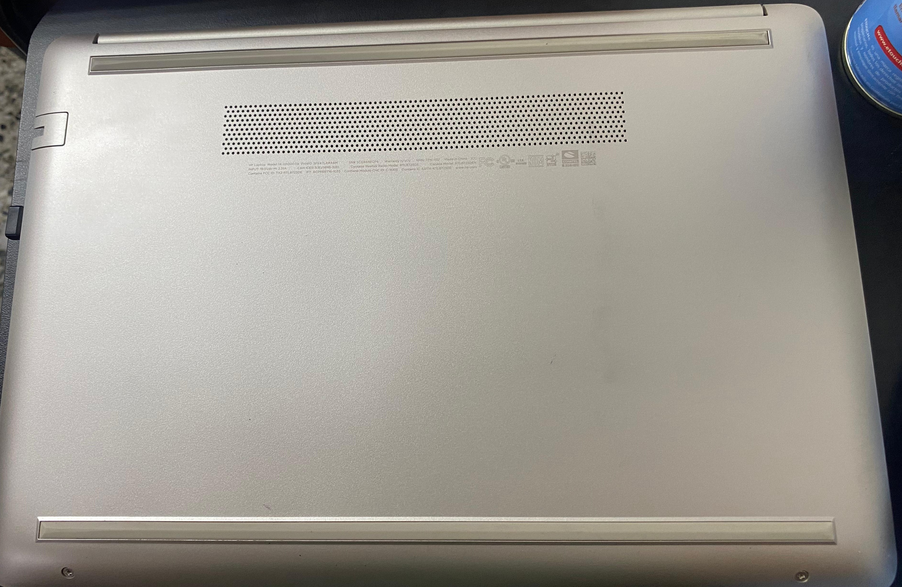
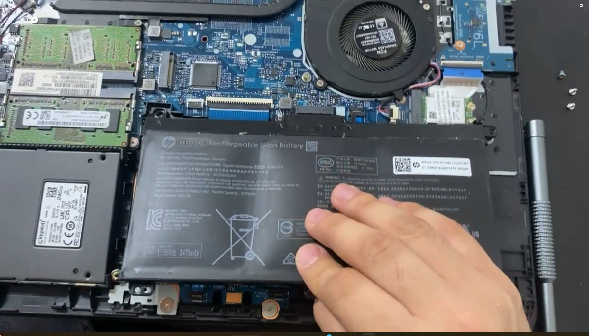
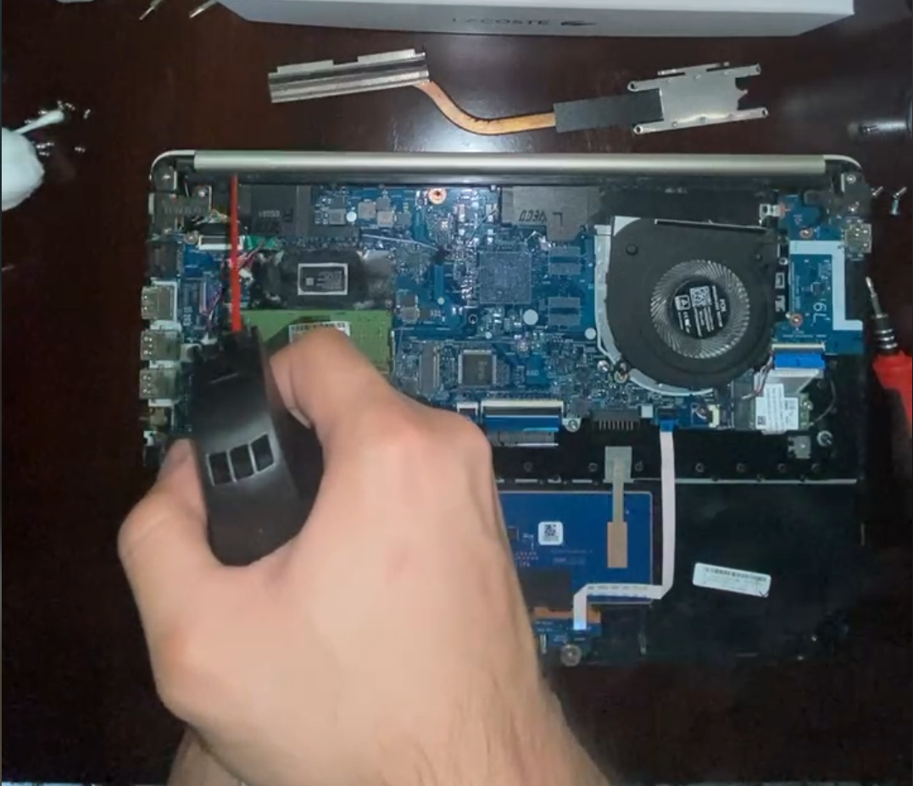
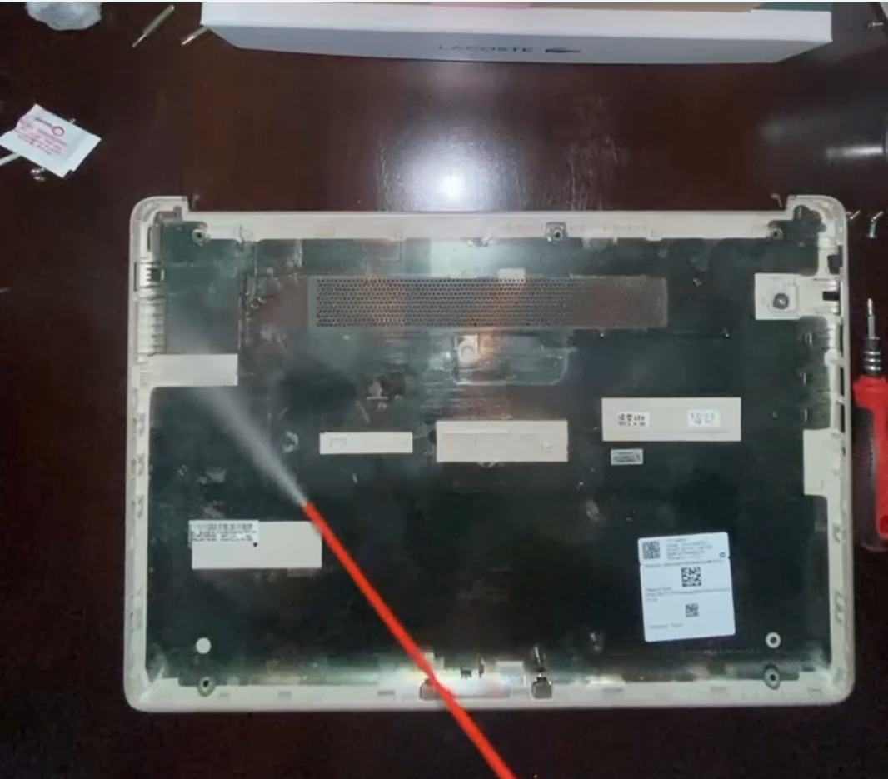
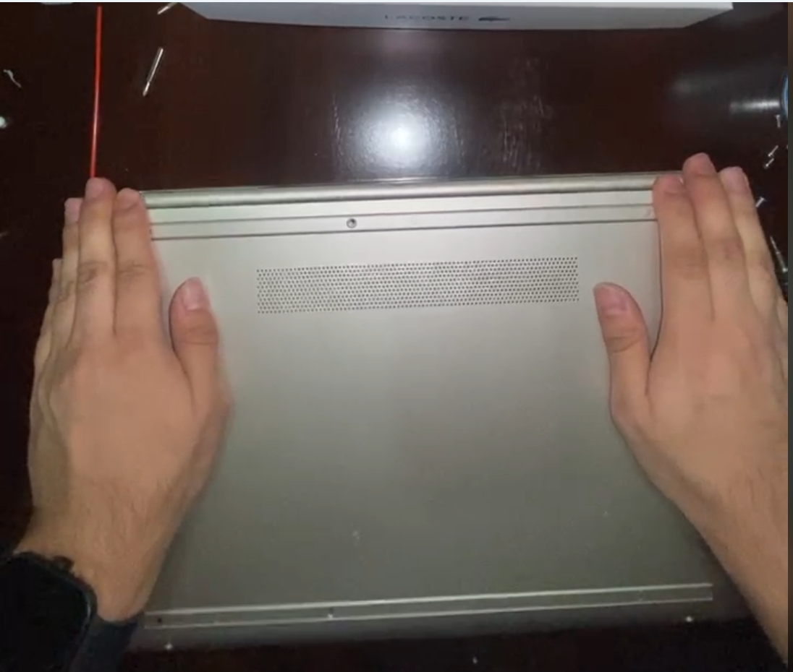
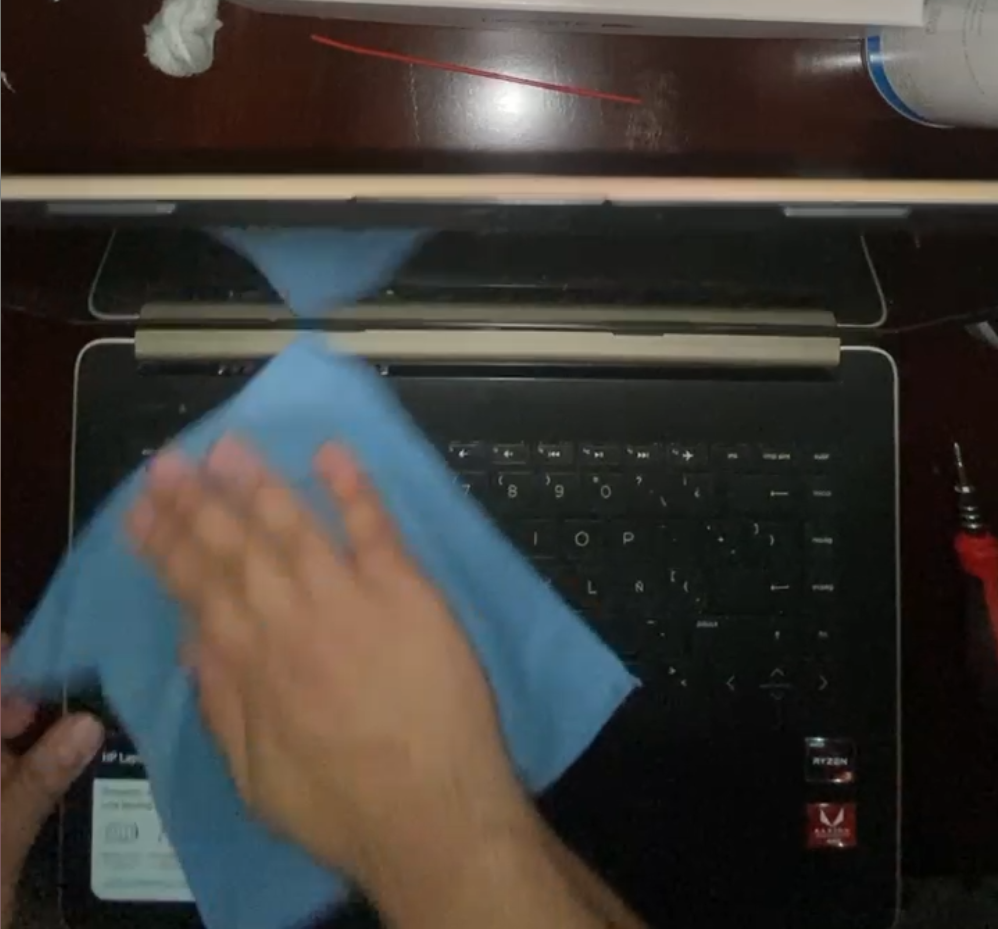
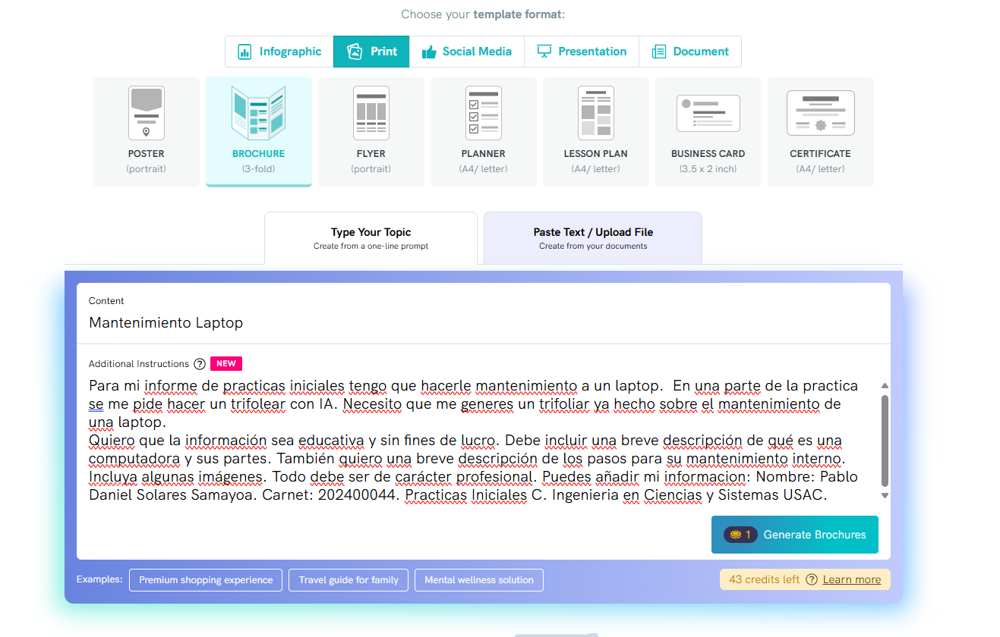

# Manual de limpieza
## ¿Qué es una computadora?
Es un dispositivo cuya funcion principal es almacenar y procesar datos en una forma veloz y precisa. Realiza este procedimiento gracias a una serie de elementos de hardware y software. Tambien una computadora es una conjunto de instrucciones llamadas programas o software mediante el hardware produciendo una salida de datos entendible para los usuarios. En resumen las computadoras tienen como principal función almacenar, procesar y comunicar información.

## Partes internas de una computadora
+ Memoria RAM
+ Tarjeta Madre
+ Procesador
+ Disco Duro
+ Bateria
+ Fuentes de poder
+ Discos SSD
+ Ventiladores

## Pasos para el mantenimiento
**1. Se coloca la laptop en una superficie solida y comoda para su manipulación**

**2. En el mantenimiento usaremos pasta termica, espuma para limpieza, aire comprimido.**

**3. Se retiran las "adhesivos" donde estan los tornillos. Es necesario hacer este paso con mucho cuidado para no dañar la carcasa de la laptop**

**4. Se verifican los lugadores donde haya tornillos. Con un destornillador se procede a quitar los tornillos**

**5. Una vez despues de quitar los tornillos, en la parte interna de la laptop (teclado) se hace palanca para quitar la carcasa de la laptop**

**6. Posterior a que la parte interna de la laptop no esta apretada, se procede a darle vuelva para asi quitar la carcasa ejerciendo presion**

**7. Una vez destapada la laptop, por seguridad se desconecta la bateria**

**8. Se retira la Tarjeta RAM se ve sucia se remueve y se le aplica limpia contactos**

**9. Se retira el procesador y se le aplica la pasta termica con mucho cuidado**

**10. Se utliza el aire comprimido en las partes donde sean necesarias**

**11. Se limpia la carcasa de la laptop**
 
**12. Se coloca la carcasa y se ajusta con presión**

**13. Se vuelve a atornillar la laptop**

**14. Para que el mantenimiento con la espuma y el paña limpia contactos se limpia el teclado, la pantalla y las partes externas de la laptop**

**15. Como ultimo paso se verifica el correcto funcionamiento de la laptop**

## Ayuda
1. Usar herramientas de calidad para asegurnos de no dañar la laptop
2. Ver el manual de la laptop o buscarlo en internet, ya que cada laptop dependiendo de la marca y modelo tiene una forma diferente de desamblarla
3. Usar los desatornilladores correctos dependiendo de la forma y tamaño de los tornillos para no dañarlos

## Trifoliar
#### Promp:
Para mi informe de practicas iniciales tengo que hacerle mantenimiento a un laptop.  En una parte de la practica se me pide hacer un trifolear con IA. Necesito que me generes un trifoliar ya hecho sobre el mantenimiento de una laptop.
Quiero que la información sea educativa y sin fines de lucro. Debe incluir una breve descripción de qué es una computadora y sus partes. También quiero una breve descripción de los pasos para su mantenimiento interno. Incluya algunas imágenes. Todo debe ser de carácter profesional.
#### Imagenes del promp:

#### IA utilizada: https://piktochart.com

## Video
[Link](https://youtu.be/bpTMsbLv4tA)