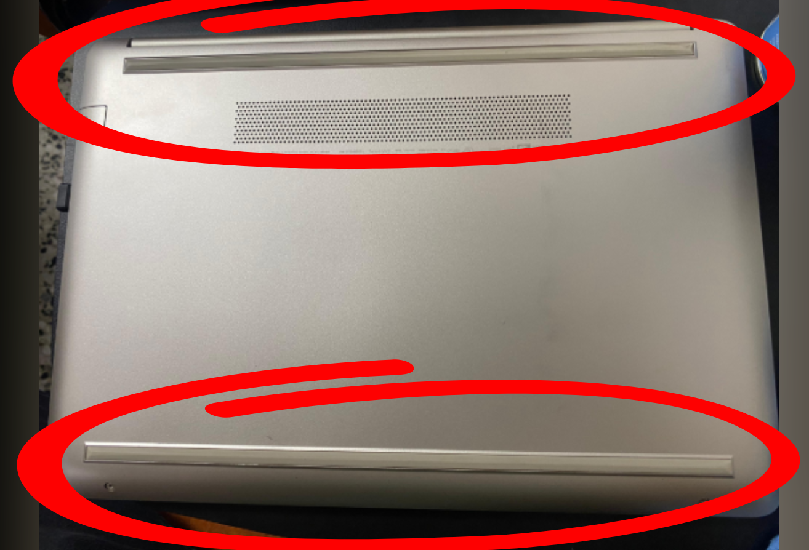
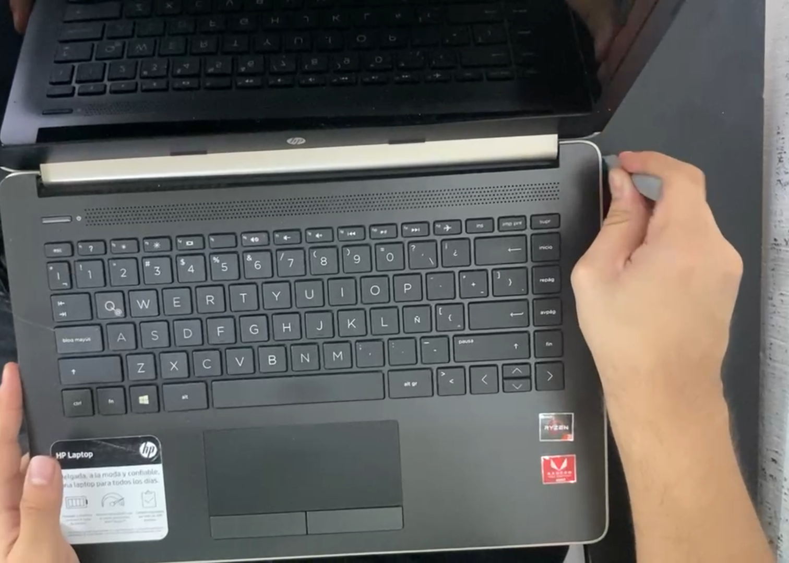

# Manual de Limpieza y Mantenimiento Interno de una Laptop

## ¿Qué es una computadora?

Una computadora es un dispositivo electrónico cuya función principal es **almacenar, procesar y comunicar información** de forma rápida y precisa. Esto es posible gracias a la interacción entre el **hardware** (componentes físicos) y el **software** (programas). Las computadoras ejecutan instrucciones definidas por los programas para producir una salida comprensible para los usuarios.

---

## Partes internas de una computadora

Los componentes internos más importantes de una laptop son:

- **Memoria RAM**
- **Tarjeta madre (motherboard)**
- **Procesador (CPU)**
- **Disco duro (HDD)**
- **Disco de estado sólido (SSD)**
- **Batería**
- **Fuente de poder**
- **Ventiladores de enfriamiento**

---

## Pasos para el mantenimiento interno

**1. Colocar la laptop en una superficie sólida y cómoda para trabajar.**  

**2. Herramientas necesarias: pasta térmica, espuma limpiadora, aire comprimido y paño antiestático.**  

**3. Retirar cuidadosamente los adhesivos que cubren los tornillos. Este paso debe hacerse con precaución para evitar dañar la carcasa.**  

**4. Localizar todos los tornillos y retirarlos con el destornillador adecuado.**  

**5. Una vez retirados los tornillos, hacer palanca desde el teclado para desprender la carcasa superior.**  

**6. Dar la vuelta a la laptop para retirar la carcasa inferior aplicando presión uniforme.**  

**7. Con la laptop abierta, desconectar la batería como medida de seguridad.**  

**8. Retirar la memoria RAM, limpiarla con líquido limpia-contactos y volver a insertarla con cuidado.**  

**9. Retirar el disipador del procesador, limpiar los restos de pasta térmica anterior, y aplicar una nueva capa.**  

**10. Aplicar aire comprimido en zonas con acumulación de polvo, como ventiladores y ranuras.**  

**11. Limpiar la carcasa interna con un paño seco y libre de pelusa.**  

**12. Reensamblar la carcasa, asegurándose de que todas las partes encajen correctamente.**  

**13. Volver a colocar todos los tornillos en su lugar.**  

**14. Limpiar las partes externas como teclado, pantalla y cubierta, utilizando espuma limpiadora y paño adecuado.**  

**15. Encender la laptop y verificar su funcionamiento general.**  

---

## Recomendaciones y ayuda

1. Utilizar herramientas de calidad para evitar dañar los componentes internos.  
2. Consultar el manual de servicio de la laptop o buscar instrucciones específicas en línea, ya que el desmontaje puede variar según la marca y el modelo.  
3. Usar destornilladores adecuados al tipo y tamaño de los tornillos para evitar que se barran o dañen.

---
## Video
[Link Video-Tutorial](https://youtu.be/bpTMsbLv4tA)