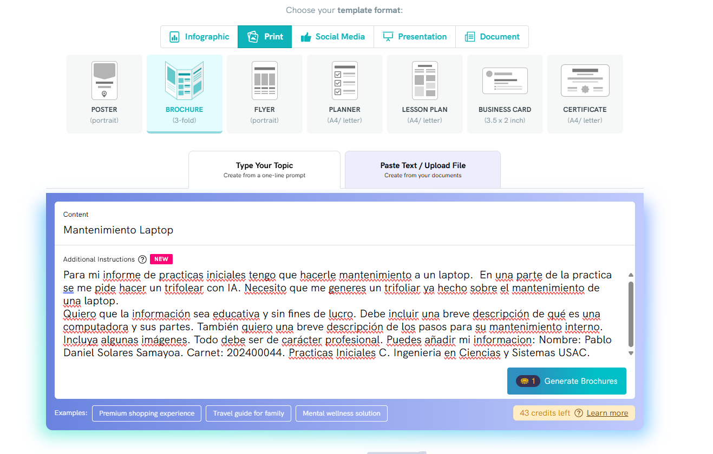

## Trifoliar
#### Promp:
Para mi informe de practicas iniciales tengo que hacerle mantenimiento a un laptop.  En una parte de la practica se me pide hacer un trifolear con IA. Necesito que me generes un trifoliar ya hecho sobre el mantenimiento de una laptop.
Quiero que la información sea educativa y sin fines de lucro. Debe incluir una breve descripción de qué es una computadora y sus partes. También quiero una breve descripción de los pasos para su mantenimiento interno. Incluya algunas imágenes. Todo debe ser de carácter profesional.
#### Imagenes del promp:

#### IA utilizada: https://piktochart.com
