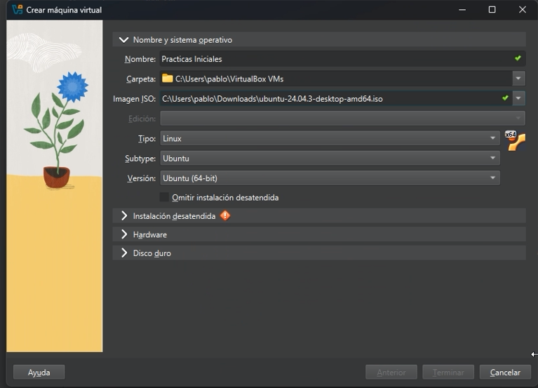
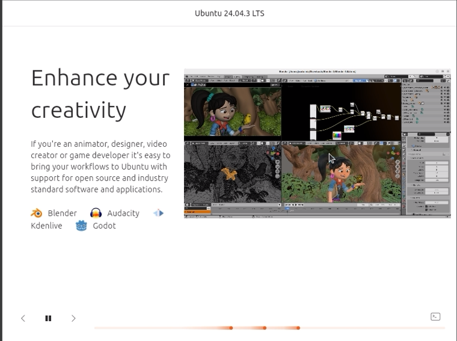
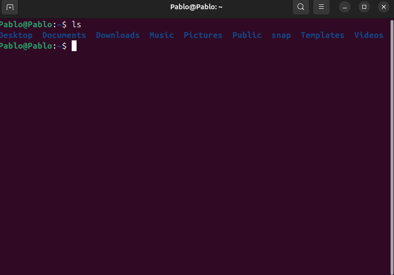

# PRÁCTICA DE SISTEMAS OPERATIVOS  
## INSTALACIÓN DE UBUNTU EN MÁQUINA VIRTUAL  

### PASO 1 - DESCARGAS  
Para comenzar con la instalación de Ubuntu necesitamos la imagen del sistema operativo.  
La imagen se puede descargar en el siguiente enlace: [Descargar Ubuntu 24.04.03 LTS](https://ubuntu.com/download/desktop).  

  

En esta práctica utilizaremos una máquina virtual. Para ello debemos instalar **VirtualBox**, un software gratuito y fácil de usar, que se puede descargar en: [Descargar VirtualBox](https://www.virtualbox.org/).  

  

---

### PASO 2 - INSTALACIÓN DE VIRTUALBOX  
Una vez descargado, ejecutamos el archivo `VirtualBox-7.1.12.169651-win.exe`.  

  

Durante la instalación no es necesario modificar las configuraciones predeterminadas. Simplemente damos clic en **Siguiente** en cada paso hasta finalizar.  

  
  
  
  
  
  
  

Al finalizar, marcamos la opción **Start Oracle VirtualBox** y hacemos clic en **Finish**.  

  

---

### PASO 3 - CONFIGURACIÓN DE LA MÁQUINA VIRTUAL  
Este paso es fundamental, ya que una correcta configuración garantiza el buen funcionamiento del sistema operativo.  

1. Abrimos **Oracle VirtualBox** y damos clic en el botón **Nuevo** de la barra superior.  
     

2. Se abrirá una ventana donde debemos asignar un nombre a la máquina virtual y seleccionar la imagen ISO de Ubuntu descargada previamente.  
     

   - El nombre de la máquina virtual queda a elección del usuario.  
   - Una vez cargada la imagen, VirtualBox detectará automáticamente el sistema operativo y su distribución.  
     

3. En la pestaña **Instalación desatendida**, configuramos el nombre de usuario y la contraseña (estos datos quedan a discreción del usuario).  
     

4. En la pestaña **Hardware**, asignamos los recursos:  
   - **Memoria RAM:** Se recomienda 4 GB.  
   - **Procesadores:** Se recomienda 6 núcleos.  
    Es importante no exceder los límites recomendados por el software, ya que dependen del hardware de cada dispositivo.  
     

5. En la pestaña **Disco duro**, asignamos el espacio de almacenamiento.  
   - Se recomienda un mínimo de **25 GB**.  
     

6. Finalmente, damos clic en **Terminar** para completar la configuración.  
     

---

### PASO 4 - INSTALACIÓN Y CONFIGURACIÓN DE UBUNTU  
Una vez finalizada la configuración, la máquina virtual se iniciará automáticamente y comenzará la instalación de Ubuntu.  
Este proceso es automático y puede tardar varios minutos.  

  
  
  

Cuando la instalación finalice, el sistema operativo estará listo para usarse.  

Una de las ventajas de la máquina virtual es que las configuraciones básicas, como la conexión a Internet y la red, ya vienen listas por defecto, por lo que no es necesario realizar ajustes adicionales.  

  

---

##  ¡Instalación completada! Ubuntu está listo para utilizarse en la máquina virtual.

## USO DE LA TERMINAL - CONSOLA
## 1. Navegar entre archivos y directorios  
- **Comando:** `cd`  
- **Uso:** Permite moverse entre carpetas y archivos. 

--- 
## 2. Ver el contenido de un directorio  
- **Comando:** `ls`  
- **Uso:** Lista los archivos y carpetas de la ubicación actual.  

---

## 3. Crear carpetas en un directorio  
- **Comando:** `mkdir`  
- **Uso:** Crea nuevas carpetas.  

---

## 4. Copiar archivos y carpetas  
- **Comando:** `cp`  
- **Uso:** Copia archivos y carpetas de un directorio a otro. El -r  hace que la copia sea recursiva, lo que significa que se copiarán todos los archivos y subdirectorios dentro de la carpeta especificada.  

---

## 5. Mover archivos y carpetas  
- **Comando:** `mv`  
- **Uso:** Mueve o renombra archivos y carpetas de un directorio a otro.  

---

## 6. Eliminar archivos y carpetas  
- **Comando:** `rm`  
- **Uso:** Elimina archivos y carpetas de un directorio.  

---

## 7. Ingresar como superusuario  
- **Comando:** `sudo`  
- **Uso:** Permite ejecutar comandos con privilegios de administrador.  

---

## 8. Actualizar permisos de archivos o directorios  
- **Comando:** `chmod`  
- **Uso:** Modifica los permisos de lectura, escritura y ejecución de archivos o directorios. Este comando dará permiso de lectura, escritura y ejecución al propietario, grupo y público.

---

## 9. Crear/editar un archivo de texto desde la terminal  
- **Comando:** `nano` / `touch`  
- **Uso:** Crear o editar un archivo directamente desde la terminal.  

---

## 10. Instalar paquetes desde la terminal  
- **Comando:** `sudo apt install`  
- **Uso:** Instala programas o paquetes desde los repositorios oficiales.  

---

## 11. Actualizar paquetes desde la terminal  
- **Comando:** `sudo apt update && sudo apt upgrade`  
- **Uso:** Actualiza la lista de paquetes y los programas instalados en el sistema.  

---

## 12. Eliminar paquetes desde la terminal  
- **Comando:**  `sudo apt purge`  
- **Uso:** Elimina paquetes instalados en el sistema (con o sin configuración).  
